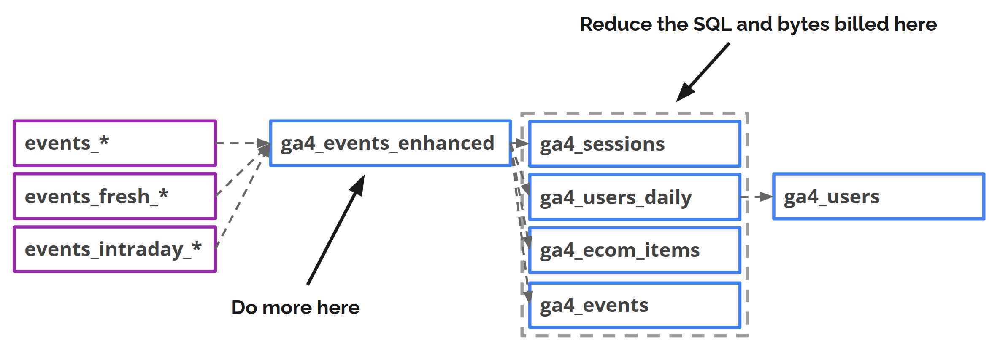

# ga4-export-fixer

[](https://www.npmjs.com/package/ga4-export-fixer)

**ga4-export-fixer** is a **Dataform NPM package** that transforms raw GA4 BigQuery export data into a cleaner, more queryable incremental table. It combines **daily, fresh (360), and intraday exports** so the best available version of each event is always in use, adds session-level fields like `session_id` and `landing_page`, promotes key event parameters to columns, and fixes known GA4 export issues — handling the boilerplate transformations that are otherwise tedious to include in every GA4 query.

The goal of the package is to **speed up development** when building data models and pipelines on top of GA4 export data, allowing you to focus on your use case instead of wrestling with the raw export format.



*Example data model built with ga4-export-fixer*

### Table of Contents
<!-- TOC -->
  - [Main Features](#main-features)
  - [Planned, Upcoming Features](#planned-upcoming-features)
- [Installation](#installation)
  - [Bash](#bash)
  - [In Google Cloud Dataform](#in-google-cloud-dataform)
- [Usage](#usage)
  - [Create GA4 Events Enhanced Table](#create-ga4-events-enhanced-table)
  - [Configuration Object](#configuration-object)
  - [Assertions](#assertions)
  - [Creating Incremental Downstream Tables from ga4_events_enhanced](#creating-incremental-downstream-tables-from-ga4_events_enhanced)
  - [Helpers](#helpers)
- [License](#license)
<!-- /TOC -->

### Main Features

<table>
<tr>
<td width="50%" valign="top">
  <b>📦 Best Available Data</b><br>
  Combines daily, fresh (360) &amp; intraday exports so the most complete version is always available
</td>
<td width="50%" valign="top">
  <b>🔄 Incremental Updates</b><br>
  Run on any schedule — daily, hourly, or custom
</td>
</tr>
<tr>
<td valign="top">
  <b>📐 Flexible Schema</b><br>
  Keeps the flexible structure of the original export with key fields promoted to columns for better query performance; partitioning &amp; clustering enabled
</td>
<td valign="top">
  <b>🤖 AI Agent Ready</b><br>
  Extensive table &amp; column descriptions for AI agents and humans
</td>
</tr>
<tr>
<td valign="top">
  <b>🔑 Session Identity Resolution</b><br>
  <code>user_id</code> resolved per session; <code>merged_user_id</code> coalesces with <code>user_pseudo_id</code>
</td>
<td valign="top">
  <b>📡 Session Traffic Sources</b><br>
  <code>session_first_traffic_source</code> and <code>session_traffic_source_last_click</code> computed automatically, adjusting for sessions that span midnight
</td>
</tr>
<tr>
<td valign="top">
  <b>📍 Landing Page Detection</b><br>
  Derived per session from the first page where <code>entrances > 0</code>
</td>
<td valign="top">
  <b>🔗 Page URL Parsing</b><br>
  Parsed <code>hostname</code>, <code>path</code>, <code>query</code>, and <code>query_params</code> from <code>page_location</code>
</td>
</tr>
<tr>
<td valign="top">
  <b>🛒 Ecommerce Data Fixes</b><br>
  Nullifies placeholder <code>transaction_id</code>; corrects <code>purchase_revenue</code> bugs
</td>
<td valign="top">
  <b>🏷️ Item List Attribution</b><br>
  Attributes <code>item_list_name</code>, <code>item_list_id</code>, and <code>item_list_index</code> from item selection events to downstream ecommerce events
</td>
</tr>
<tr>
<td valign="top">
  <b>⚙️ Event Parameter Handling</b><br>
  Promote event params to columns; include or exclude by name
</td>
<td valign="top">
  <b>📊 Session Parameters</b><br>
  Promote selected event parameters as <code>session_params</code>
</td>
</tr>
<tr>
<td valign="top">
  <b>⏱️ Custom Timestamp</b><br>
  Use a custom event parameter as primary timestamp with automatic fallback
</td>
<td valign="top">
  <b>🔒 Schema Lock</b><br>
  Lock table schema to a specific GA4 export date to prevent schema drift
</td>
</tr>
<tr>
<td valign="top">
  <b>✅ Data Freshness Tracking</b><br>
  <code>data_is_final</code> flag and <code>export_type</code> label on every row
</td>
<td valign="top">
  <b>🔃 Selective Re-processing</b><br>
  Re-process a date range without full table rebuild using <code>incrementalStartOverride</code> and <code>incrementalEndOverride</code>
</td>
</tr>
<tr>
<td valign="top">
  <b>📑 Batch Processing</b><br>
  Process large exports in smaller batches via <code>numberOfDaysToProcess</code>
</td>
<td valign="top">
  <b>🕐 Timezone-Aware Datetime</b><br>
  <code>event_datetime</code> converted to a configurable IANA timezone
</td>
</tr>
<tr>
<td valign="top">
  <b>🛡️ Zero Dependencies</b><br>
  No additional external dependencies added to your Dataform repository
</td>
<td valign="top">
</td>
</tr>
</table>

### Planned, Upcoming Features

Features under consideration for future releases:

- Web and app specific default configurations
- Custom channel grouping
- Data enrichment (item-level, session-level, event-level)
- Custom processing steps (additional CTEs)
- Custom traffic source attribution
- Default assertions

## Installation

### Bash

```bash
npm install ga4-export-fixer
```

### In Google Cloud Dataform

Include the package in the package.json file in your Dataform repository.

**`package.json`**

```json
{
  "dependencies": {
    "@dataform/core": "3.0.42",
    "ga4-export-fixer": "0.6.1"
  }
}
```

**Note:** The best practice is to specify the package version explicitly (e.g. `"0.1.2"`) rather than using `"latest"` or `"*"`, to avoid unexpected breaking changes when the package is updated.

In Google Cloud Dataform, click "Install Packages" to install it in your development workspace.

If your Dataform repository does not have a package.json file, see this guide: [https://docs.cloud.google.com/dataform/docs/manage-repository#move-to-package-json](https://docs.cloud.google.com/dataform/docs/manage-repository#move-to-package-json)

## Usage

### Create GA4 Events Enhanced Table

Creates an **enhanced** version of the GA4 BigQuery export (daily & intraday).

#### JS Deployment (Recommended)

Create a new **ga4_events_enhanced** table using a **.js** file in your repository's **definitions** folder.

##### Using Defaults

**`definitions/ga4/ga4_events_enhanced.js`**

```javascript
const { ga4EventsEnhanced } = require('ga4-export-fixer');

const config = {
  sourceTable: constants.GA4_TABLES.MY_GA4_EXPORT
};

ga4EventsEnhanced.createTable(publish, config);
```

##### With Custom Configuration

**`definitions/ga4/ga4_events_enhanced.js`**

```javascript
const { ga4EventsEnhanced } = require('ga4-export-fixer');

const config = {
  sourceTable: constants.GA4_TABLES.MY_GA4_EXPORT,
  // use dataformTableConfig to make changes to the default Dataform table configuration
  dataformTableConfig: {
      schema: 'ga4'
  },
  // test configurations
  test: false,
  testConfig: {
      dateRangeStart: 'current_date()-1',
      dateRangeEnd: 'current_date()',
  },
  schemaLock: '20260101', // lock to daily export; also supports 'intraday_20260101' or 'fresh_20260101'
  customTimestampParam: 'custom_event_timestamp', // custom timestamp collected as an event param
  timezone: 'Europe/Helsinki',
  // not needed data
  excludedColumns: [
    'app_info',
    'publisher'
  ],
  // not needed events
  excludedEvents: [
    'session_start',
    'first_visit',
    'user_engagement'
  ],
  // transform to session-level
  sessionParams: [
    'user_agent'
  ],
  // promote as columns
  eventParamsToColumns: [
    {name: 'session_engaged'},
    {name: 'ga_session_number', type: 'int'},
    {name: 'page_type', type: 'string'},
  ],
  // not needed in the event_params array
  excludedEventParams: [
    'session_engaged',
    'ga_session_number',
    'page_type',
    'user_agent'
  ],
  // use export type for data_is_final instead of the default DAY_THRESHOLD
  dataIsFinal: {
    detectionMethod: 'EXPORT_TYPE',
  },
  // attribute item lists to downstream ecommerce events within the same session
  itemListAttribution: {
    lookbackType: 'SESSION',
  },
};

ga4EventsEnhanced.createTable(publish, config);
```

#### SQLX Deployment

Alternatively, you can create the **ga4_events_enhanced** table using a .SQLX file.

**`definitions/ga4/ga4_events_enhanced.sqlx`**

```javascript
config {
  type: "incremental",
  description: "GA4 Events Enhanced table",
  schema: "ga4",
  onSchemaChange: "EXTEND",
  bigquery: {
    partitionBy: "event_date",
    clusterBy: ['event_name', 'session_id', 'page_location', 'data_is_final'],
  },
  tags: ['ga4_export_fixer']
}

js {
  const { ga4EventsEnhanced } = require('ga4-export-fixer');

  const config = {
    sourceTable: ref(constants.GA4_TABLES.MY_GA4_EXPORT),
    self: self(),
    incremental: incremental()
  };
}

${ga4EventsEnhanced.generateSql(config)}

pre_operations {
  ${ga4EventsEnhanced.setPreOperations(config)}
}
```

### Configuration Object

All fields are optional except `sourceTable`. Default values are applied automatically, so you only need to specify the fields you want to override.


| Field                  | Type                    | Default/Required                   | Description                                                                                                                                                                                                                                                                                                                  |
| ---------------------- | ----------------------- | ---------------------------------- | ---------------------------------------------------------------------------------------------------------------------------------------------------------------------------------------------------------------------------------------------------------------------------------------------------------------------------- |
| `sourceTable`          | Dataform ref() / string | **required**                       | Source GA4 export table. Use `ref()` in Dataform or a string in format ``project.dataset.table``                                                                                                                                                                                                                             |
| `self`                 | Dataform self()         | **required for .SQLX deployment**  | Reference to the table itself. Use `self()` in Dataform                                                                                                                                                                                                                                                                      |
| `incremental`          | Dataform incremental()  | **required for .SQLX deployment**  | Switch between incremental and full refresh logic. Use `incremental()` in Dataform                                                                                                                                                                                                                                           |
| `dataformTableConfig`  | object                  | **In JS deployment only.** [See default](#default-dataformtableconfig) | Override the default Dataform table configuration for JS deployment. See: [ITableConfig reference](https://docs.cloud.google.com/dataform/docs/reference/dataform-core-reference#itableconfig) |
| `schemaLock`           | string                  | `undefined`                        | Lock the table schema to a specific GA4 export table suffix. Accepts `"YYYYMMDD"` (daily), `"intraday_YYYYMMDD"`, or `"fresh_YYYYMMDD"`. Date must be >= `"20241009"`                                                                                                                                                        |
| `timezone`             | string                  | `'Etc/UTC'`                        | IANA timezone for event datetime (e.g. `'Europe/Helsinki'`)                                                                                                                                                                                                                                                                  |
| `customTimestampParam` | string                  | `undefined`                        | Name of a custom event parameter containing a JS timestamp in milliseconds (e.g. collected via `Date.now()`)                                                                                                                                                                                                                 |
| `bufferDays`           | integer                 | `1`                                | Extra days to include for sessions that span midnight. Auto-adjusted when `itemListAttribution.lookbackType` is `'TIME'` and the lookback exceeds `bufferDays`                                                                                                                                                               |
| `itemListAttribution`  | object                  | `undefined`                        | Enable item list attribution. See [Item List Attribution](#item-list-attribution)                                                                                                                                                                                                                                            |
| `test`                 | boolean                 | `false`                            | Enable test mode (uses `testConfig` date range instead of pre-operations)                                                                                                                                                                                                                                                    |
| `excludedEventParams`  | string[]                | `[]`                               | Event parameter names to exclude from the `event_params` array                                                                                                                                                                                                                                                               |
| `excludedEvents`       | string[]                | `['session_start', 'first_visit']` | Event names to exclude from the table. These events are excluded by default because they have no use for analysis purposes. Override this to include them if needed                                                                                                                                                          |
| `excludedColumns`      | string[]                | `[]`                               | Default GA4 export columns to exclude from the final table, for example `'app_info'` or `'publisher'`                                                                                                                                                                                                                        |
| `sessionParams`        | string[]                | `[]`                               | Event parameter names to aggregate as session-level parameters                                                                                                                                                                                                                                                               |
| `includedExportTypes`  | object                  | [See details](#includedExportTypes) | Which GA4 export types to include (daily, fresh, intraday)                                                                                                                                                                                                                                                                  |
| `dataIsFinal`          | object                  | [See details](#dataIsFinal)         | How to determine whether data is final (not expected to change)                                                                                                                                                                                                                                                              |
| `testConfig`           | object                  | [See details](#testConfig)          | Date range used when `test` is `true`                                                                                                                                                                                                                                                                                        |
| `preOperations`        | object                  | [See details](#preOperations)       | Date range and incremental refresh configuration                                                                                                                                                                                                                                                                             |
| `eventParamsToColumns` | object[]                | `[]`                                | Event parameters to promote to columns. [See item schema](#eventParamsToColumns)                                                                                                                                                                                                                                             |

<a id="default-dataformtableconfig"></a>
<details>
<summary><strong>Default dataformTableConfig</strong></summary>

```json
{
    "name": "ga4_events_enhanced_<dataset_id>",
    "type": "incremental",
    "schema": "<source_dataset>",
    "description": "<default description>",
    "bigquery": {
        "partitionBy": "event_date",
        "clusterBy": [
            "event_name",
            "session_id",
            "page_location",
            "data_is_final"
        ],
        "labels": {
            "ga4_export_fixer": "true"
        }
    },
    "onSchemaChange": "EXTEND",
    "tags": [
        "ga4_export_fixer"
    ]
}
```

The `onSchemaChange: "EXTEND"` setting updates the result table schema on incremental runs, adding columns for any new fields the query produces.

</details>
<br>

<a id="includedExportTypes"></a>

**`includedExportTypes`** — which GA4 export types to include:


| Field                          | Type    | Default | Description                      |
| ------------------------------ | ------- | ------- | -------------------------------- |
| `includedExportTypes.daily`    | boolean | `true`  | Include daily (processed) export |
| `includedExportTypes.fresh`    | boolean | `false` | Include fresh (hourly-updated) export |
| `includedExportTypes.intraday` | boolean | `true`  | Include intraday export          |


Export priority: **daily > fresh > intraday**. Each lower-priority export only provides data not already covered by a higher-priority one. All seven combinations of the three export types are supported.

When all three exports are enabled, the package:
1. Gets all data from daily export tables
2. Gets fresh export data for days not yet covered by a daily table
3. Gets intraday export data for events after the latest fresh event timestamp

The boundary between fresh and intraday is timestamp-based because the fresh export is updated hourly, so within the same day some events come from the fresh export and the rest from intraday.

> **Without daily export:** When `daily` is `false`, `dataIsFinal.detectionMethod` must be set to `'DAY_THRESHOLD'`, because `EXPORT_TYPE` detection relies on daily tables to mark data as final.

<a id="dataIsFinal"></a>

**`dataIsFinal`** — how to determine whether data is final (not expected to change):


| Field                         | Type    | Default         | Description                                                                                                                                                                                     |
| ----------------------------- | ------- | --------------- | ----------------------------------------------------------------------------------------------------------------------------------------------------------------------------------------------- |
| `dataIsFinal.detectionMethod` | string  | `'DAY_THRESHOLD'` | `'DAY_THRESHOLD'` (uses days since event; data older than `dayThreshold` is considered final) or `'EXPORT_TYPE'` (uses table suffix; all data from the daily export is considered final). `'EXPORT_TYPE'` is suitable for most **web only** properties as data is rarely received with a delay. Must be `'DAY_THRESHOLD'` when daily export is not enabled |
| `dataIsFinal.dayThreshold`    | integer | `3`               | Days after which data is considered final. According to GA4 documentation, data up to 72 hours old is subject to possible changes. Required when `detectionMethod` is `'DAY_THRESHOLD'`            |


<a id="testConfig"></a>

**`testConfig`** — date range used when `test` is `true`:


| Field                       | Type              | Default              | Description                 |
| --------------------------- | ----------------- | -------------------- | --------------------------- |
| `testConfig.dateRangeStart` | string (SQL date) | `'current_date()-1'` | Start date for test queries |
| `testConfig.dateRangeEnd`   | string (SQL date) | `'current_date()'`   | End date for test queries   |


<a id="preOperations"></a>

**`preOperations`** — date range and incremental refresh configuration:


| Field                                      | Type              | Default              | Description                                                                                                                                                                                         |
| ------------------------------------------ | ----------------- | -------------------- | --------------------------------------------------------------------------------------------------------------------------------------------------------------------------------------------------- |
| `preOperations.dateRangeStartFullRefresh`  | string (SQL date) | `'date(2000, 1, 1)'` | Start date for full refresh                                                                                                                                                                         |
| `preOperations.dateRangeEnd`               | string (SQL date) | `'current_date()'`   | End date for queries                                                                                                                                                                                |
| `preOperations.numberOfPreviousDaysToScan` | integer           | `10`                 | Number of days to scan backwards from the result table's last partition when determining the incremental refresh start checkpoint. Needs to cover the number of days that can still contain not final `(data_is_final = false)` data                                                                    |
| `preOperations.incrementalStartOverride`   | string (SQL date) | `undefined`          | Override the incremental start date to re-process a specific range                                                                                                                                  |
| `preOperations.incrementalEndOverride`     | string (SQL date) | `undefined`          | Override the incremental end date to re-process a specific range                                                                                                                                    |
| `preOperations.numberOfDaysToProcess`      | integer           | `undefined`          | Limit each run to N days of data. When set, the end date becomes `start + N - 1` (capped at `current_date()`). When `undefined`, `dateRangeEnd` is used as-is. `incrementalEndOverride` takes priority  |

Date fields (`dateRangeStart`, `dateRangeEnd`, etc.) accept string dates in `YYYYMMDD` or `YYYY-MM-DD` format, or BigQuery SQL expressions (e.g. `'current_date()'`, `'date(2026, 1, 1)'`).

<a id="eventParamsToColumns"></a>

**`eventParamsToColumns`** — each item in the array is an object:


| Field        | Type   | Required | Description                                                                                                                           |
| ------------ | ------ | -------- | ------------------------------------------------------------------------------------------------------------------------------------- |
| `name`       | string | Yes      | Event parameter name                                                                                                                  |
| `type`       | string | No       | Data type: `'string'`, `'int'`, `'int64'`, `'double'`, `'float'`, or `'float64'`. If omitted, returns the value converted to a string |
| `columnName` | string | No       | Column name in the output. Defaults to the parameter `name`                                                                           |


<a id="item-list-attribution"></a>

**`itemListAttribution`** — when set to an object, enables attribution of `item_list_name`, `item_list_id`, and `item_list_index` from `select_item`/`select_promotion` events to downstream ecommerce events (e.g. `add_to_cart`, `purchase`). Disabled by default.

| Field            | Type    | Required                    | Description                                                           |
| ---------------- | ------- | --------------------------- | --------------------------------------------------------------------- |
| `lookbackType`   | string  | Yes                         | `'SESSION'` (partition by session) or `'TIME'` (time-based window)    |
| `lookbackTimeMs` | integer | When `lookbackType: 'TIME'` | Lookback window in milliseconds (e.g. `86400000` for 24h)            |

```javascript
// Session-based: attribute within the same session
itemListAttribution: { lookbackType: 'SESSION' }

// Time-based: attribute within a 24-hour window across sessions
itemListAttribution: { lookbackType: 'TIME', lookbackTimeMs: 86400000 }
```

> **Note:** This feature adds a compute-heavy CTE with a window function over unnested items. Only enable it if you need item list attribution for ecommerce analysis.

### Assertions

The package includes built-in data quality assertions that can be automatically created alongside the enhanced events table. Pass Dataform's `assert` function as the third argument to `createTable`:

```javascript
ga4EventsEnhanced.createTable(publish, config, { assert });
```

This creates the table along with the default-enabled assertions, using the same configuration:

| Assertion | Name | Enabled by default | Description |
| --------- | ---- | ------------------ | ----------- |
| `dailyQuality` | `{tableName}_daily_quality` | Yes | Compares session count, event count, and item revenue per day between the enhanced table and raw export. Detects missing days, count mismatches, and non-final data inflation |
| `itemRevenue` | `{tableName}_item_revenue` | No (opt-in) | Reconciles item_revenue at the (event_date, item_id) grain between the enhanced table and raw export |

Assertions inherit the table's schema and tags from `dataformTableConfig`. Each assertion queries the last 5 days of data.

#### Selective Assertions

Enable opt-in assertions by setting them to `true`, or disable default-enabled ones by setting them to `false`:

```javascript
ga4EventsEnhanced.createTable(publish, config, {
    assert,
    assertions: { dailyQuality: true, itemRevenue: true },
});
```

#### Assertion Config Overrides

Override the assertion's Dataform configuration (name, schema, tags):

```javascript
ga4EventsEnhanced.createTable(publish, config, {
    assert,
    assertions: {
        dailyQuality: { tags: ['data_quality', 'ga4_export_fixer'] },
    },
});
```

#### Standalone Assertions (SQLX Deployment)

For SQLX deployments or when you need full control, assertions can also be used as standalone SQL generators:

```javascript
const { ga4EventsEnhanced } = require('ga4-export-fixer');

assert('daily_quality_check', {
    schema: 'analytics_123456789',
    tags: ['ga4_export_fixer'],
}).query(ctx => {
    return ga4EventsEnhanced.assertions.dailyQuality(
        ctx.ref('ga4_events_enhanced_123456789'),
        { ...config, sourceTable: ctx.ref(config.sourceTable) }
    );
});
```

### Creating Incremental Downstream Tables from ga4_events_enhanced

Setting up incremental updates is easy using the **setPreOperations()** function. Just ensure that your result table includes the **data_is_final** flag from the **ga4_events_enhanced** table.

The **incrementalDateFilter()** function applies the same date filtering used by **ga4_events_enhanced**, based on the **config** options and the variables declared by **setPreOperations()**.

Key fields such as session_id, user_id, and session_traffic_source_last_click are available as clean, sessionized versions that handle edge cases like sessions spanning midnight.

**`definitions/ga4/ga4_sessions.sqlx`**

```javascript
config {
  type: "incremental",
  description: "GA4 sessions table",
  schema: "ga4_export_fixer",
  bigquery: {
    partitionBy: "event_date",
    clusterBy: ['session_id', 'data_is_final'],
  },
  tags: ['ga4_export_fixer']
}

js {
  const { setPreOperations, helpers } = require('ga4-export-fixer');

  const config = {
    self: self(),
    incremental: incremental(),
    /*
    Default options that can be overriden:
    test: false,
    testConfig: {
        dateRangeStart: 'current_date()-1',
        dateRangeEnd: 'current_date()',
    },
    preOperations: {
        dateRangeStartFullRefresh: 'date(2000, 1, 1)',
        dateRangeEnd: 'current_date()',
        // incremental date range overrides allow re-processing only a subset of the data:
        //incrementalStartOverride: undefined,
        //incrementalEndOverride: undefined,
    },
    */
  };
}

select
  event_date,
  session_id,
  user_pseudo_id,
  user_id,
  any_value(session_traffic_source_last_click.cross_channel_campaign) as session_traffic_source,
  any_value(landing_page) as landing_page,
  current_datetime() as row_inserted_timestamp,
  min(data_is_final) as data_is_final
from
  ${ref('ga4_events_enhanced_298233330')}
where
  ${helpers.incrementalDateFilter(config)}
group by 
  event_date,
  session_id,
  user_pseudo_id,
  user_id

pre_operations {
  ${setPreOperations(config)}
}
```

### Helpers

The helpers contain templates for common SQL expressions. The functions are referenced by **ga4EventsEnhanced** but can also be imported as utility functions for working with GA4 data.

```javascript
const { helpers } = require('ga4-export-fixer');
```

#### SQL Templates


| Name        | Example             | Description                                                               |
| ----------- | ------------------- | ------------------------------------------------------------------------- |
| `eventDate` | `helpers.eventDate` | Casts `event_date` string to a DATE using YYYYMMDD format                 |
| `sessionId` | `helpers.sessionId` | Builds a session ID by concatenating `user_pseudo_id` and `ga_session_id` |


#### Functions

**Unnesting parameters**


| Function           | Example                                       | Description                                                                                                                                                                                  |
| ------------------ | --------------------------------------------- | -------------------------------------------------------------------------------------------------------------------------------------------------------------------------------------------- |
| `unnestEventParam` | `unnestEventParam('page_location', 'string')` | Extracts a value from the `event_params` array by key. Supported types: `'string'`, `'int'`, `'int64'`, `'double'`, `'float'`, `'float64'`. Omit type to get the value converted as a string |


**Date and time**


| Function                  | Example                                             | Description                                                                                                                              |
| ------------------------- | --------------------------------------------------- | ---------------------------------------------------------------------------------------------------------------------------------------- |
| `getEventTimestampMicros` | `getEventTimestampMicros('custom_ts')`              | Returns SQL for event timestamp in microseconds. With a custom parameter, uses it (converted from ms) with fallback to `event_timestamp` |
| `getEventDateTime`        | `getEventDateTime({ timezone: 'Europe/Helsinki' })` | Returns SQL for event datetime in the given timezone. Defaults to `'Etc/UTC'`                                                            |


**Date filters**


| Function              | Example                                                              | Description                                                                                            |
| --------------------- | -------------------------------------------------------------------- | ------------------------------------------------------------------------------------------------------ |
| `ga4ExportDateFilter` | `ga4ExportDateFilter('daily', 'current_date()-7', 'current_date()')` | Generates a `_table_suffix` filter for a single export type (`'daily'` or `'intraday'`) and date range |


**Page details**


| Function                | Example                                  | Description                                                                                                        |
| ----------------------- | ---------------------------------------- | ------------------------------------------------------------------------------------------------------------------ |
| `extractUrlHostname`    | `extractUrlHostname('page_location')`    | Extracts hostname from a URL column                                                                                |
| `extractUrlPath`        | `extractUrlPath('page_location')`        | Extracts the path component from a URL column                                                                      |
| `extractUrlQuery`       | `extractUrlQuery('page_location')`       | Extracts the query string (including `?`) from a URL column                                                        |
| `extractUrlQueryParams` | `extractUrlQueryParams('page_location')` | Parses URL query parameters into `ARRAY<STRUCT<key STRING, value STRING>>`                                         |
| `extractPageDetails`    | `extractPageDetails()`                   | Returns a struct with `hostname`, `path`, `query`, and `query_params`. Defaults to `page_location` event parameter |


**Aggregation**


| Function         | Example                                                | Description                                                                                                                               |
| ---------------- | ------------------------------------------------------ | ----------------------------------------------------------------------------------------------------------------------------------------- |
| `aggregateValue` | `aggregateValue('user_id', 'last', 'event_timestamp')` | Aggregates a column using `'max'`, `'min'`, `'first'`, `'last'`, or `'any'`. `'first'` and `'last'` use the timestamp column for ordering |


**Ecommerce**


| Function             | Example                | Description                                                                                                                                 |
| -------------------- | ---------------------- | ------------------------------------------------------------------------------------------------------------------------------------------- |
| `fixEcommerceStruct` | `fixEcommerceStruct()` | Cleans the ecommerce struct: sets `transaction_id` to null when `'(not set)'`, and fixes missing/NaN `purchase_revenue` for purchase events |


**Data freshness**


| Function      | Example                           | Description                                                                                                                                                                                           |
| ------------- | --------------------------------- | ----------------------------------------------------------------------------------------------------------------------------------------------------------------------------------------------------- |
| `isFinalData` | `isFinalData('DAY_THRESHOLD', 3)` | Returns SQL that evaluates to `true` when data is final. `'DAY_THRESHOLD'` uses days since event (`dayThreshold` is required and must be a non-negative integer); `'EXPORT_TYPE'` checks table suffix |


## License

MIT